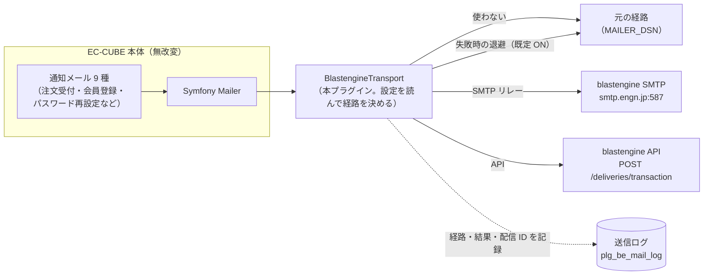
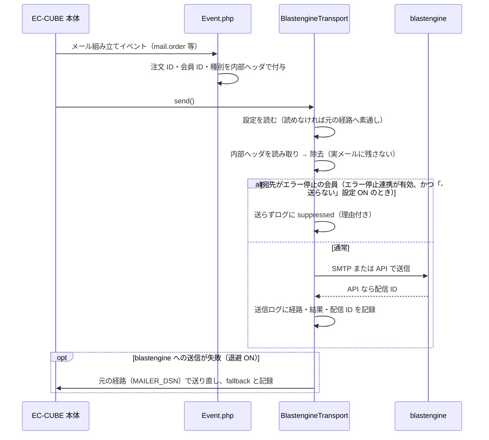
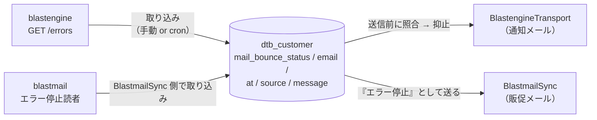

# BlastengineMailer 設計資料

どういう作りで、何を気を付けて作っているかをまとめる。**急いで読むなら、図 2 つと「気を付けていること」の表だけで全体がつかめる。**

- 使い方・検証状況（どこまで実機で確認済みか）: [README.md](README.md)
- 正はこのディレクトリのコード（2026-09-28 に通読して記述）。本文とコードが食い違ったらコードが正で、この文書を直す

## 一言でいうと

**EC-CUBE の「送信口」だけを差し替えるプラグイン。** メールを組み立てる処理には一切触れず、Symfony Mailer が最後に使う Transport を包んで（デコレートして）、送信の瞬間に経路を決める。

- `.env` の `MAILER_DSN` は書き換えない。プラグインを無効化すれば完全に元へ戻る
- 「使わない」を選んでも Transport は挟まったままだが、素通しするだけ

## 構成要素

| 部品 | 役割 |
|---|---|
| [Event.php](Event.php) | メール組み立てイベント（`mail.order` 等 9 種）を購読し、注文 ID・会員 ID・メール種別を**内部ヘッダ**として付ける |
| [Service/BlastengineTransport.php](Service/BlastengineTransport.php) | 中核。元の Transport を包み、送信時に設定を読んで経路を決める。抑止・退避・ログもここ |
| [Service/BlastengineApiClient.php](Service/BlastengineApiClient.php) | blastengine API の薄いクライアント（送信・配信照会・エラー停止一覧）。Bearer 認証の組み立ても担当 |
| [Service/BounceService.php](Service/BounceService.php) | 宛先状態（エラー停止）の判定・取り込み・解除。会員の列 `mail_bounce_*` を読み書き |
| [Service/SecretCrypter.php](Service/SecretCrypter.php) | パスワード・API キーの暗号化（`ECCUBE_AUTH_MAGIC` から HKDF-SHA256 で鍵派生 → libsodium secretbox） |
| Entity / Repository | `Config`（設定 1 行）、`MailLog`（送信ログ）、`CustomerBounceTrait`（会員に宛先状態の列を追加） |
| Controller / Form | 設定画面（接続テスト・テスト送信）、送信ログ一覧、宛先不明の会員一覧、会員編集への宛先状態表示 |
| [Command/BounceSyncCommand.php](Command/BounceSyncCommand.php) | `blastengine:bounce-sync`。cron でエラー停止一覧を差分取得 |

## メール 1 通が送られるまで

なぜ内部ヘッダ経由か: メールの組み立て（イベント）と送信（Transport）は別の場所・別のタイミングで起きる。注文 ID などの文脈をメッセージ自体に乗せて運び、送信直前に外すことで、**本体のどのクラスにも手を入れずに**ログへ文脈を残せる。ヘッダはあくまでプラグイン内の運搬用なので、どの経路でも（「使わない」の素通しでも）送信前に必ず外し、実際のメールには残さない（受信者に内部 ID が見えない）。

## 気を付けていること

| 原則 | 恐れている事故 | 実装 |
|---|---|---|
| **通知メールは絶対に落とさない** | 注文受付メールが届かない＝店の事故 | 失敗時は元の経路へ退避（既定 ON）。プラグインのテーブルが無い・設定が読めないときも素通しで送る |
| **黙って落とさない** | 「送られなかったこと」が誰にも見えない | 抑止（suppressed）・失敗（failed）・退避（fallback）をすべて送信ログに理由付きで残す |
| **本体を書き換えない** | アップデートやテーマ変更で壊れる | Transport のデコレートとイベント購読のみ。`MAILER_DSN`・テンプレートは無改変 |
| **秘密は DB 単独流出で漏れない** | DB ダンプの流出で API キーが漏れる | サーバー側秘密値 `ECCUBE_AUTH_MAGIC` から派生した鍵で暗号化。DB には平文を置かない |
| **ログは送信の巻き添えにしない** | 送信元のトランザクション失敗でログも消える | ログの書き込みは DBAL で直接行い、EntityManager の状態に依存しない |
| **危ない機能は既定オフ** | 知らないうちに送信が抑止される | エラー停止連携（列の追加・送信抑止）は明示的に有効化した店舗だけ。抑止時も注文自体は残る |
| **判定は自動で失効する** | アドレスを変えた会員に送られ続けない／止まり続けない | 宛先不明の判定は「判定時のアドレス」とセットで持ち、現在のアドレスと違えば自動で有効扱いに戻る |

## エラー停止連携のデータの流れ

宛先状態は「本人の意思（受信可否）」とは別軸の**宛先の事実**。BlastmailSync と列を共有し、通知メールと販促メールの両方に効かせる。

## 動作環境

EC-CUBE 4.3 系（PHP 8.1 以上、libsodium）。
